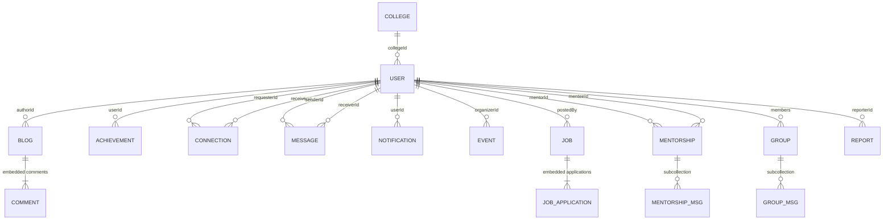

# Firestore database schema (reference only)

This file is **not** imported or used by the application. It summarizes the Reconnect app’s Cloud Firestore layout for UML / ER modeling. Types and fields are inferred from `firestore.rules`, `src/types/index.ts`, and `src/services/*Firestore*.ts`. Actual stored shapes may include extra fields from older writes.

**Conventions**

- **Document ID**: Firestore auto-ID unless noted (e.g. `users` doc ID = Firebase Auth UID).
- **Timestamp**: stored as Firestore `Timestamp` in many writes; the app sometimes reads these as ISO `string`. Model as *datetime* in UML.
- **→** denotes a logical foreign key (string holding another document’s ID).

---

## Top-level collections

| Collection        | Document ID              | Purpose |
|------------------|--------------------------|---------|
| `users`          | Firebase Auth UID        | All roles: superadmin, subadmin, alumni, student, user |
| `colleges`       | Auto                     | College / institute records |
| `blogs`          | Auto                     | Blog posts (draft/published) |
| `achievements`   | Auto                     | User achievements |
| `connections`    | Auto                     | Connection requests between users |
| `messages`       | Auto                     | Direct messages (1:1) |
| `notifications`  | Auto                     | In-app notifications |
| `events`         | Auto                     | Platform events |
| `jobs`           | Auto                     | Job postings + embedded applications |
| `mentorships`    | Auto                     | Mentor–mentee requests/sessions |
| `groups`         | Auto                     | Chapters / interest / batch groups |
| `reports`        | Auto                     | Moderation content reports |

---

## Subcollections

| Path | Document ID | Purpose |
|------|---------------|---------|
| `mentorships/{mentorshipId}/messages` | Auto | Thread messages after mentorship accepted/completed |
| `groups/{groupId}/messages` | Auto | Group chat messages |

---

## Entity: `users` (`users/{userId}`)

**Primary key:** `userId` (matches Auth UID for self-signup users).

| Field | Type | Notes |
|-------|------|--------|
| `id` | string | Often duplicated in app layer; doc key is source of truth |
| `email` | string | |
| `name` | string | |
| `role` | string | `superadmin` \| `subadmin` \| `alumni` \| `student` \| `user` |
| `createdAt` | Timestamp / string | |
| `universityId` | string? | |
| `collegeId` | string? | → `colleges` |
| `profilePicture` | string? | URL |
| `phone` | string? | |
| `verifiedAlumni` | boolean? | |
| `industry` | string? | |
| `lastActiveAt` | string? | |
| `openToMentoring` | boolean? | |
| `profileVisibility` | string? | `public` \| `private` |
| **Alumni-specific (when `role` = `alumni`)** | | |
| `graduationYear` | number | |
| `degree` | string | |
| `department` | string | |
| `currentCompany` | string? | |
| `currentPosition` | string? | |
| `location` | string? | |
| `bio` | string? | |
| `skills` | array\<string\> | |
| `connections` | array\<string\> | → `users` (peer IDs) |
| `socialLinks` | map | `linkedin`, `twitter`, `github`, `instagram`, `personal` (strings) |
| `address` | string? | |
| `experience` | array\<map\> | See **WorkExperience** |
| `education` | array\<map\> | See **Education** |
| `achievements` | array | May be present; canonical achievements often live in `achievements` collection |
| `blogs` | array | May be present for denormalization; canonical blogs in `blogs` |
| **Student-specific** | | |
| `currentYear` | number | |
| `rollNumber` | string | |
| **Common user** | | |
| `interests` | array\<string\> | |

### Embedded: WorkExperience (in `users.experience[]`)

| Field | Type |
|-------|------|
| `id` | string |
| `company` | string |
| `position` | string |
| `startDate` | string |
| `endDate` | string? |
| `description` | string |
| `current` | boolean |

### Embedded: Education (in `users.education[]`)

| Field | Type |
|-------|------|
| `id` | string |
| `institution` | string |
| `degree` | string |
| `field` | string |
| `startYear` | number |
| `endYear` | number? |
| `grade` | string? |

---

## Entity: `colleges` (`colleges/{collegeId}`)

| Field | Type | Notes |
|-------|------|--------|
| `name` | string | |
| `universityId` | string | Logical parent (no `universities` collection in Firestore for this app) |
| `logo` | string? | |
| `description` | string | |
| `departments` | array\<string\> | |
| `createdAt` | Timestamp | |
| `establishedYear` | number | |
| `website` | string? | |
| `contactEmail` | string | |
| `phone` | string? | |
| `adminName` | string | |
| `adminEmail` | string | |
| `adminPassword` | string | Stored as provided (sensitive) |
| `adminContactNumber` | string? | |

---

## Entity: `blogs` (`blogs/{blogId}`)

| Field | Type | Notes |
|-------|------|--------|
| `title` | string | |
| `content` | string | |
| `excerpt` | string | |
| `coverImage` | string? | |
| `tags` | array\<string\> | |
| `authorId` | string | → `users` |
| `publishedAt` | Timestamp | |
| `likes` | number | |
| `likedBy` | array\<string\> | → `users` |
| `comments` | array\<map\> | See **Comment (embedded)** |
| `shares` | number | |
| `status` | string? | `draft` \| `published` |
| `moderationStatus` | string? | `ok` \| `flagged` \| `removed` |
| `reportCount` | number? | |

### Embedded: Comment (in `blogs.comments[]`)

| Field | Type | Notes |
|-------|------|--------|
| `id` | string | |
| `content` | string | |
| `authorId` | string | → `users` |
| `blogId` | string | |
| `createdAt` | string | |
| `author` | map? | Sometimes `{}` placeholder; resolved in app |

---

## Entity: `achievements` (`achievements/{achievementId}`)

| Field | Type | Notes |
|-------|------|--------|
| `title` | string | |
| `description` | string | |
| `date` | Timestamp | |
| `category` | string | `academic` \| `professional` \| `personal` \| `community` |
| `image` | string? | |
| `userId` | string | → `users` |

---

## Entity: `connections` (`connections/{connectionId}`)

| Field | Type | Notes |
|-------|------|--------|
| `requesterId` | string | → `users` |
| `receiverId` | string | → `users` |
| `status` | string | `pending` \| `accepted` \| `rejected` |
| `createdAt` | Timestamp | |

---

## Entity: `messages` (`messages/{messageId}`) — direct DM

| Field | Type | Notes |
|-------|------|--------|
| `senderId` | string | → `users` |
| `receiverId` | string | → `users` |
| `content` | string | |
| `read` | boolean | |
| `readAt` | string? | |
| `deletedBy` | array\<string\>? | User IDs |
| `createdAt` | Timestamp | |

---

## Entity: `notifications` (`notifications/{notificationId}`)

| Field | Type | Notes |
|-------|------|--------|
| `userId` | string | Recipient → `users` |
| `type` | string | `message`, `connection`, `comment`, `event`, `job_match`, `job_application`, `mentorship`, `system`, … |
| `title` | string | |
| `body` | string | |
| `read` | boolean | |
| `createdAt` | Timestamp | |
| `link` | string? | Client route |
| `actorId` | string? | → `users` (who triggered) |
| `messageId` | string? | → `messages` (for type `message`) |
| `mentorshipId` | string? | → `mentorships` |
| `jobId` | string? | → `jobs` |
| `meta` | map? | string → string (deep link metadata) |

---

## Entity: `events` (`events/{eventId}`)

| Field | Type | Notes |
|-------|------|--------|
| `title` | string | |
| `description` | string | |
| `startAt` | Timestamp | |
| `endAt` | Timestamp? | |
| `location` | string | |
| `organizerId` | string | → `users` |
| `attendeeIds` | array\<string\> | → `users` |
| `createdAt` | Timestamp | |
| `collegeId` | string? | → `colleges` |

---

## Entity: `jobs` (`jobs/{jobId}`)

| Field | Type | Notes |
|-------|------|--------|
| `title` | string | |
| `company` | string | |
| `location` | string | |
| `description` | string | |
| `postedBy` | string | → `users` |
| `remote` | boolean | |
| `role` | string | Job role label (not user role) |
| `applications` | array\<map\> | See **JobApplication (embedded)** |
| `createdAt` | Timestamp | |

### Embedded: JobApplication (in `jobs.applications[]`)

| Field | Type | Notes |
|-------|------|--------|
| `userId` | string | → `users` |
| `appliedAt` | string | ISO |
| `note` | string? | |
| `status` | string? | `pending` \| `accepted` \| `rejected` |

---

## Entity: `mentorships` (`mentorships/{mentorshipId}`)

| Field | Type | Notes |
|-------|------|--------|
| `mentorId` | string | → `users` |
| `menteeId` | string | → `users` |
| `topic` | string | |
| `status` | string | `pending` \| `accepted` \| `declined` \| `completed` |
| `sessionDate` | string? | |
| `createdAt` | Timestamp | |

### Subcollection: `mentorships/{id}/messages/{msgId}`

| Field | Type | Notes |
|-------|------|--------|
| `mentorshipId` | string | Parent id |
| `senderId` | string | → `users` |
| `content` | string | |
| `createdAt` | Timestamp | |

---

## Entity: `groups` (`groups/{groupId}`)

| Field | Type | Notes |
|-------|------|--------|
| `name` | string | |
| `description` | string | |
| `type` | string | `chapter` \| `interest` \| `batch` |
| `members` | array\<string\> | → `users` |
| `adminIds` | array\<string\> | → `users` |
| `createdAt` | Timestamp | |
| `batchYear` | number? | |

### Subcollection: `groups/{id}/messages/{msgId}`

| Field | Type | Notes |
|-------|------|--------|
| `groupId` | string | Parent id |
| `senderId` | string | → `users` |
| `content` | string | |
| `createdAt` | Timestamp | |

---

## Entity: `reports` (`reports/{reportId}`)

| Field | Type | Notes |
|-------|------|--------|
| `targetType` | string | `blog` \| `comment` \| `user` |
| `targetId` | string | Id of reported entity |
| `reporterId` | string | → `users` |
| `reason` | string | |
| `createdAt` | Timestamp | |
| `status` | string | `open` \| `reviewed` \| `dismissed` |

---

## Relationships (for UML associations)

- **User** is central: referenced by `blogs.authorId`, `achievements.userId`, `connections` (both sides), `messages` (sender/receiver), `notifications.userId` / `actorId`, `events.organizerId` / `attendeeIds`, `jobs.postedBy` / `applications[].userId`, `mentorships` (mentor/mentee) and submessages `senderId`, `groups.members` / `adminIds` and group messages `senderId`, `reports.reporterId`, and optional `users.collegeId` → **College**.
- **Blog** → **User** (`authorId`); **Blog** embeds **Comment** (which references **User** via `authorId`).
- **Job** embeds **JobApplication** → **User**.
- **Mentorship** → two **Users**; **MentorshipMessage** belongs to **Mentorship** (subcollection).
- **Group** → many **Users**; **GroupMessage** belongs to **Group** (subcollection).
- **Direct Message** is a separate top-level **messages** collection (not under users).

---

## Composite indexes (from `firestore.indexes.json`)

Used for queries; helpful when labeling “indexed” in diagrams:

- `notifications`: `userId` ASC, `createdAt` DESC  
- `events`: `startAt` ASC  
- `jobs`: `createdAt` DESC  
- `blogs`: `status` ASC, `publishedAt` DESC  
- Collection group `messages`: `createdAt` ASC (supports subcollection group queries)

---

## Mermaid sketch (logical ER)

---

*Generated for documentation / UML only. Update this file if collections or fields change.*
